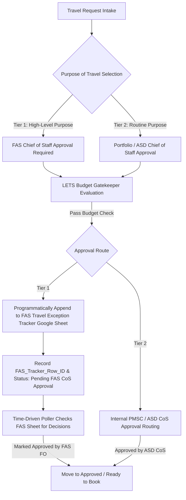

# LETS (Logistics, Events, and Travel System)
## Comprehensive Technical Architecture & OpenCode Transfer Blueprint

---

### Executive Overview & Strategic Intent

The **Logistics, Events, and Travel System (LETS)** was designed to replace manual, fragmented spreadsheets with an automated, centralized system of record for intaking, approving, budgeting, tracking, and reconciling all travel and event activities across the organization.

LETS operates as an intelligent command center that:
1. **Directly Adopts the Authentic GSA/AAS TRIP Application**: Uses the complete, proven user experience, GSA design tokens, per-diem caching, and role-based workflows of the TRIP application as its baseline foundation.
2. **Implements an Active Financial Governance Engine**: Tracks FY27 baseline travel pools, applies self-funded and enterprise-shared set-asides, monitors temporary commitments (estimates), liquidates them upon post-travel voucher submission (actuals), and enforces hard budget checks to prevent deficits.
3. **Ensures EO 14222 & FAS Delegation Policy Compliance**: Accommodates the Federal Acquisition Service (FAS) Delegation of Travel-Approving Official Authority policy by enforcing a two-tiered approval routing engine and programmatically interfacing with the mandated **FAS Travel Exception Tracker Google Sheet**.

---

### 1. Project Identifiers & Repository Links

| Asset / System | Identifier / URL | Notes |
| :--- | :--- | :--- |
| **GitHub Repository** | `https://github.com/clolry/LETS` | Branch: `main` (Authenticated via SSH) |
| **Active GAS Project ID** | `1xDKibOChZtiBW4c1CP2xwbwNLPP-cH-Dgk8jFAPSryIKuL8VaF-tcGJr` | Project Title: `GSA_FCA0A_"LETS"` |
| **Parent Container** | `1kXB7eVII_EOlZEHSd-4vl3psTJZv57JvnrplhD2FA9Y` | Container-bound Google Sheet |
| **Reference TRIP App** | `1Bt_rs-1C8vR-Gydfhu2pBX5X9_olp_wHY497kMxn1pT97dXmzJm-pSkP` | Source snapshot in `reference_travel_app/` |
| **Reference Training Tracker** | `1sV1zkTTSRmAQ_Aak0W8BpABLNnqD61ZpzCs-xx7BWCnkPBsuUzxqcXuI` | Source snapshot in `reference_training_tracker/` |
| **Reference Excel Trackers**| `FY23 CONCUR...` & `FY23 TRAVEL REPORT...` | Archived in `reference_excel_files/` |

---

### 2. CI/CD Pipeline & GitHub Deployment

- **Deployment Workflow File**: `.github/workflows/deploy-gas.yml`
- **Configuration File**: `lets_app/.clasp.json` (pointing to script ID `1xDKibOChZtiBW4c1CP2xwbwNLPP-cH-Dgk8jFAPSryIKuL8VaF-tcGJr`)
- **Ignore Rules**: `lets_app/.claspignore` (filters out test files and local mocks, pushing only clean GAS code)
- **CI Triggers**:
  - `pull_request`: Runs automatically on PR creation/synchronization.
  - `push` to `main`: Deploys on merge.
  - `workflow_dispatch`: One-click manual trigger button in the GitHub Actions tab.
- **Authentication Secret**: `CLASPRC_JSON` in GitHub Repository Secrets.

---

### 3. Core Financial & Budget Allocation Engine

LETS is pre-loaded with the baseline **FY27 travel budget structure** and executes real-time accounting logic.

#### A. Starting Allocations & Proportional Shares
- **Front Office / AC**: $4,000 (0.0% share)
- **OMD DAC**: $152,000 (15.3% proportional share)
- **IDV DAC**: $659,000 (66.4% proportional share)
- **CM DAC**: $182,000 (18.3% proportional share)
- *Total DAC Baseline*: $993,000 | *Total Baseline*: $997,000

#### B. Set-Aside Governance
1. **DAC-Specific (Self-Funded) Set-Asides**:
   - $12,000 "DAC LC Travel" deducted directly from each of OMD, IDV, and CM ($36,000 total).
   - $52,500 "COE Program" deducted solely from CM DAC.
2. **Shared / Enterprise Set-Asides**:
   - $20,000 "Front Office LC Travel Gap" treated as a shared ASD responsibility and automatically deducted using proportional shares:
     - OMD (15.3%): $3,060
     - IDV (66.4%): $13,280
     - CM (18.3%): $3,660

#### C. Expense Lifecycle & Double-Counting Prevention
- **Authorization Phase (Intake)**: Captures line-item **Estimated Cost**, creating a temporary commitment against the DAC's discretionary balance.
- **Voucher Phase (Reconciliation)**: Captures line-item **Actual Cost** after travel is completed.
- **Double-Counting Prevention**: When an Actual Cost is posted, the temporary Estimated Cost for that trip is cleared from the pending total, and the variance (Actual - Estimated) is reconciled.

#### D. The Core Formula
$$\text{Available Balance} = (\text{Baseline} + \text{MidYearAdjustments}) - \text{SelfFundedSetAsides} - \text{EnterpriseSetAsides} - \text{PendingEstimates} - \text{PostedActuals}$$

#### E. Mandatory Budget Gatekeeper
Before any request is sent for leadership approval, LETS evaluates whether the DAC's projected balance after the trip is $\ge \$0$.
- **Sufficient Funds**: Proceeds to leadership approval.
- **Insufficient Funds**: Flagged with a deficit warning and routed into an "Exception Approval" path.

---

### 4. Policy Compliance: EO 14222 & FAS Delegation of Authority

The system implements the FAS Delegation of Travel-Approving Official Authority policy via two distinct approval tiers:



#### A. Tier 1: FAS Chief of Staff (FAS CoS) Approval
Required for:
1. Travel to Foreign Areas (OCONUS) *(Event Tracker Required)*
2. Highly Attended Event (HAE) Participation *(Event Tracker Required)*
3. Non-GSA Conference & Event Attendance *(Event Tracker Required)*
4. Conference Speaking or Presenter Role (Non-GSA) *(Event Tracker Required)*
5. Internal Management Meetings (IMMs) exceeding $10,000 *(Event Tracker Required)*
6. Non-Federal source funded / fee-waived events *(Event Tracker Required)*
7. Third-party training > $7,000 (Continuing Service Agreement required)

#### B. Tier 2: Portfolio-Level Chief of Staff (e.g., ASD CoS / CREATE) Approval
Authorized for:
1. GSA-Sponsored or Co-sponsored Events
2. Compliance Site Visits / Inspections
3. Customer or Agency Engagement
4. Vendor Engagement
5. Client-Paid Travel
6. Internal Management Meetings (IMMs) under $10,000
7. Training under $7,000 or internal GSA training

#### C. FAS Travel Exception Tracker Google Sheet Integration Service
Implemented in `server/30_services/FASTrackerSync.js`:
- `submitToFASTracker(request)`: Appends Request ID, Timestamp, Requester Name, Owning Office, Purpose, Dates, Destination, Estimate, and Justification to the official FAS Google Sheet, returning `fasRowId`.
- `FAS_Tracker_Row_ID`: Stored in the LETS request record for exact row tracking.
- `syncFASTrackerStatus()`: Scheduled 15-minute background polling function that scans the FAS Sheet for status decisions ("Approved" / "Rejected") and automatically advances the LETS request.

---

### 5. Repository File Structure & Module Map

```
LETS/
├── .github/
│   └── workflows/
│       └── deploy-gas.yml             # GitHub Actions CI/CD to push code to GAS on PR/push
├── lets_app/                          # Active, deployable LETS application codebase
│   ├── .clasp.json                    # Configured with Project ID 1xDKibOChZtiBW...
│   ├── .claspignore                  # Excludes local test files and development mocks
│   ├── appsscript.json                # GAS manifest (V8 runtime, Drive & Gmail services)
│   ├── preview.html                   # Local standalone browser preview
│   ├── test_budget_engine.js          # Automated Node.js unit test suite for financial math
│   ├── client/
│   │   ├── components/                # aasLogo, flatpickrConfig, loaders, modals
│   │   ├── controllers/               # Form, portal, reviewer, and admin JS controllers
│   │   ├── pages/
│   │   │   ├── travelPortalPage.html  # Main portal with LETS branding & budget nav
│   │   │   ├── travelRequestPage.html # Intake form with Owning Office & Purpose dropdowns
│   │   │   ├── travelBudgetDashboardPage.html # Executive Financial Dashboard
│   │   │   ├── travelReviewPage.html  # Reviewer workflow & approval screen
│   │   │   ├── travelAdminPage.html   # User & role administration
│   │   │   └── letsKanbanPage.html    # Kanban board view
│   │   ├── shared/                    # Per-diem calculation, dates, locations, utils
│   │   └── styles/                    # Tokens, Bootstrap 5.3 integration, portal & form CSS
│   └── server/
│       ├── 00_config/
│       │   ├── TripConfig.js          # App constants, FAS delegation taxonomy, and settings
│       │   └── BudgetConfig.js        # FY27 allocations, set-asides, and approver mappings
│       ├── 20_data/
│       │   ├── TravelDB.js            # TRIP database schema and operations
│       │   └── LetsDB.js              # LETS relational tables (Budgets, Requests, Travelers)
│       ├── 30_services/
│       │   ├── BudgetEngine.js        # Core financial formulas, double-counting & gatekeeper
│       │   ├── FASTrackerSync.js      # FAS Travel Exception Tracker integration service
│       │   └── PerDiemGSA/DoD/Foreign # Official federal per-diem rate lookup services
│       ├── 40_domain/                 # Submission, review, user, and reporting business logic
│       ├── 50_pages/
│       │   └── Render.js              # Page-server functions (portal, form, review, budget)
│       └── 90_entrypoint/
│           └── doGet.js               # HTTP entrypoint & mode router (?mode=travel, form, budget)
├── reference_travel_app/              # Cloned snapshot of original TRIP app (93 files)
├── reference_training_tracker/        # Cloned snapshot of FCB Training Tracker (Code.js, HTML)
└── reference_excel_files/             # FY23 CONCUR & FY23 TRAVEL REPORT legacy sheets
```

---

### 6. Transferring Development to OpenCode (Agency Approved Environment)

When opening OpenCode in your agency environment:

1. **Clone the Repository**:
   ```bash
   git clone git@github.com:clolry/LETS.git
   cd LETS
   ```
2. **Verify Node & Dependencies**:
   - Ensure Node.js 20+ is active.
   - Run the automated test suite to verify math and business logic:
     ```bash
     cd lets_app
     node test_budget_engine.js
     ```
3. **Google Apps Script Properties Configuration**:
   In your container-bound Google Apps Script project (`GSA_FCA0A_"LETS"`):
   - Navigate to **Project Settings** > **Script Properties**.
   - Configure the following keys:
     * `TRAVEL_DB_SPREADSHEET_ID`: The ID of your LETS Google Sheet database.
     * `FAS_TRACKER_SPREADSHEET_ID`: The Google Sheet ID of the official **FAS Travel Exception Tracker**.
4. **Deploying Code from OpenCode**:
   - With clasp authenticated in OpenCode:
     ```bash
     cd lets_app
     clasp push
     ```
   - Or, simply create a feature branch, commit changes, and submit a Pull Request on GitHub. GitHub Actions will automatically execute the deployment to project `1xDKibOChZtiBW4c1CP2xwbwNLPP-cH-Dgk8jFAPSryIKuL8VaF-tcGJr`.

---

### 7. Immediate Engineering Roadmap

1. **Wire `travelRequestTravelers.html` to Budget Engine**:
   - Ensure the multi-traveler table in Step 3 populates both Estimated costs during intake and unlocks Actual cost inputs during post-travel reconciliation.
2. **Schedule the FAS Poller Trigger**:
   - In GAS, add an installable time-driven trigger calling `FASTrackerSync.syncFASTrackerStatus()` every 15 minutes.
3. **Finalize Org Approver Routing**:
   - Connect `Org_Approvers` to the email notification dispatch so that requests for OMD, IDV, and CM route to their designated primary and alternate approvers.
